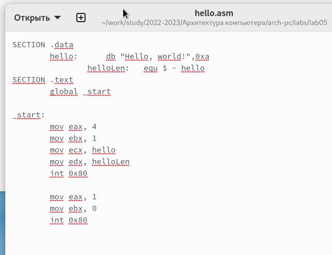
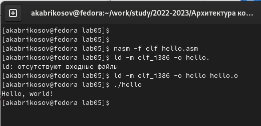
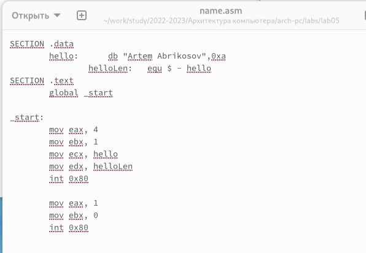

---
## Front matter
title: "Отчёта по лабораторной работе 5"
subtitle: "Создание и процесс обработки программ на языке ассемблера NASM"
author: "Абрикосов Артем Камович"

## Generic otions
lang: ru-RU
toc-title: "Содержание"

## Bibliography
bibliography: bib/cite.bib
csl: pandoc/csl/gost-r-7-0-5-2008-numeric.csl

## Pdf output format
toc: true # Table of contents
toc-depth: 2
lof: true # List of figures
lot: true # List of tables
fontsize: 12pt
linestretch: 1.5
papersize: a4
documentclass: scrreprt
## I18n polyglossia
polyglossia-lang:
  name: russian
  options:
	- spelling=modern
	- babelshorthands=true
polyglossia-otherlangs:
  name: english
## I18n babel
babel-lang: russian
babel-otherlangs: english
## Fonts
mainfont: PT Serif
romanfont: PT Serif
sansfont: PT Sans
monofont: PT Mono
mainfontoptions: Ligatures=TeX
romanfontoptions: Ligatures=TeX
sansfontoptions: Ligatures=TeX,Scale=MatchLowercase
monofontoptions: Scale=MatchLowercase,Scale=0.9
## Biblatex
biblatex: true
biblio-style: "gost-numeric"
biblatexoptions:
  - parentracker=true
  - backend=biber
  - hyperref=auto
  - language=auto
  - autolang=other*
  - citestyle=gost-numeric
## Pandoc-crossref LaTeX customization
figureTitle: "Рис."
tableTitle: "Таблица"
listingTitle: "Листинг"
lofTitle: "Список иллюстраций"
lotTitle: "Список таблиц"
lolTitle: "Листинги"
## Misc options
indent: true
header-includes:
  - \usepackage{indentfirst}
  - \usepackage{float} # keep figures where there are in the text
  - \floatplacement{figure}{H} # keep figures where there are in the text
---

# Цель работы

Целью работы является освоение процедуры компиляции и сборки программ, написанных на ассемблере NASM.

# Задание

1. Изучите программу HelloWorld и скомпилируйте ее.

2. С помощью любого текстового редактора внесите изменения в текст программы так, 
чтобы вместо Hello world! на экран выводилась строка с вашими фамилией и именем.

3. Скомпилируйте новую программу и проверьте ее работу.

4. Загрузите файлы на GitHub.

# Теоретическое введение

NASM (англ. Netwide Assembler) – это 80x86 ассемблер, разработанный исходя из принципов переносимости и модульности. Он поддерживает широкий диапазон форматов объектных файлов, включая форматы Linuxa.out и ELF, NetBSD/FreeBSD, COFF, Microsoft 16-bit OBJ и Win32. Он способен также создавать простые бинарные файлы. Синтакс NASM максимально упрощен для понимания и похож на синакс Intel, но слегка посложнее. Он поддерживает инструкции Pentium, P6 и MMX, а также имеет макро-расширения.

NASM был создан Саймоном Тэтхемом совместно с Юлианом Холлом и в настоящее время развивается небольшой командой разработчиков на SourceForge.net. Первоначально он был выпущен согласно его собственной лицензии, но позже эта лицензия была заменена на GNU LGPL после множества проблем, вызванных выбором лицензии. Начиная с версии 2.07 лицензия заменена на «упрощённую BSD» (BSD из 2 пунктов).

NASM может работать на платформах, отличных от x86, таких как SPARC и PowerPC, однако код он генерирует только для x86 и x86-64.

NASM успешно конкурирует со стандартным в Linux- и многих других UNIX-системах ассемблером gas. Считается, что качество документации у NASM выше, чем у gas. Кроме того, ассемблер gas по умолчанию использует AT&T-синтаксис, ориентированный на процессоры не от Intel, в то время как NASM использует вариант традиционного для x86-ассемблеров Intel-синтаксиса; Intel-синтаксис используется всеми ассемблерами для под DOS/Windows, например, MASM, TASM, fasm.

В NASM используется Intel-синтаксис записи инструкций. Предложение языка ассемблера NASM (строка программы) может состоять из следующих элементов:Метка, Инструкция, Операнды, Комментарий.

Операнды отделяются между собой запятой. Перед строкой и после инструкции можно использовать любое количество пробельных символов. Комментарий начинается с точки с запятой, а концом комментария считается конец строки. В качестве инструкции может использоваться команда или псевдокоманда (директива компилятора). Если строка очень длинная, то её можно перенести на следующую, используя обратный слеш ( \ ), подобно тому, как это делается в языке Си.

# Выполнение лабораторной работы

1. Создали каталог lab05 командой mkdir,
перешел в него с помощью команды cd, 
скачал с ТУИС файл hello.asm и положил в папку. (рис. [-@fig:001])

2. Открыли файл и изучили текст программы (рис. [-@fig:001])

{ #fig:001 width=70%, height=70% }

2. Транслировали файл командой nasm

3. Выполнили линковку командой ld и получили исполняемый файл и запустили его (рис. [-@fig:002])

{ #fig:002 width=70%, height=70% }

4. Изменили сообщение Hello world на свое имя и запустили файл еще раз (рис. [-@fig:003], [-@fig:004])

{ #fig:003 width=70%, height=70% }

{ #fig:004 width=70%, height=70% }

# Выводы

Освоили процесс компиляции и сборки программ, написанных на ассемблере nasm.

# Вопросы для самопроверки

1. Какие основные отличия ассемблерных программ от программ на языках
высокого уровня? - Ассемблер позволяет работать с ресурсами компьютера на уровне ядра ОС. 
Это язык низкого уровня, в котором с помощью кодовых инструкций пишутся команды 
прямо для процессора и регистров.

2. В чём состоит отличие инструкции от директивы на языке ассемблера? - Инструкции выполняются прямо процессором как машинные команды.
Директивы не выполняются как команды, а обрабатываются транслятором в инструкции

3. Перечислите основные правила оформления программ на языке ассемблера. - 
Типичный формат записи команд NASM имеет вид:
```[метка:] мнемокод [операнд {, операнд}] [; комментарий]```

4. Каковы этапы получения исполняемого файла? - Написание кода программы, трансляция кода в объектный файл, линковка объектного файла в исполняемый.

5. Каково назначение этапа трансляции? - — преобразование с помощью транслятора, например nasm, 
текста программы в машинный код, называемый объектным

6. Каково назначение этапа компоновки? - этап обработки объектного кода компоновщиком (ld), который принимает на вход объектные файлы и собирает по
ним исполняемый файл.

7. Какие файлы могут создаваться при трансляции программы, какие из них 
создаются по умолчанию? - Создается объектный файл .o и можно получить файл листинга .lst.

8. Каковы форматы файлов для nasm и ld? - для nasm на вход подается текст программы в формате .asm.
для ld подается объектный файл, полученный от nasm, в формате .o

# Список литературы{.unnumbered}

1. [Расширенный ассемблер: NASM](https://www.opennet.ru/docs/RUS/nasm/)
2. [MASM, TASM, FASM, NASM под Windows и Linux](https://habr.com/ru/post/326078/)


